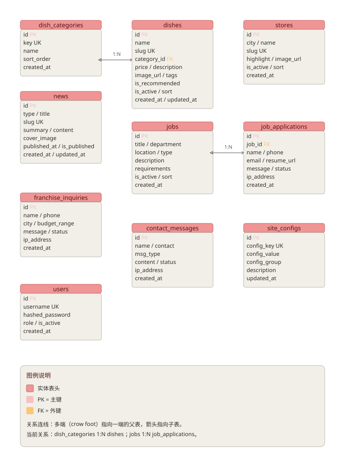

# 味禾小馆官网 · 数据库设计文档

> 版本：v1.2  
> 依据：PRD v1.4 + 开发技术文档 v1.3 + UI/UX 设计规范 v1.0  
> 数据库：PostgreSQL 14+  
> 字符集：UTF-8（`utf8mb4` 等价语义，`pg` 默认 UTF8）  
> 适用范围：味禾小馆官网全栈量产版（React + FastAPI + PostgreSQL）

---

## 1. 概述

### 1.1 设计目标

将 PRD 中的业务对象持久化为关系型数据库结构，满足：

- 菜品中心、门店案例、新闻动态、招商加盟、人才招聘、在线留言等业务数据的可维护存储；
- 站点配置（备案号、联系方式、隐私政策等）的灵活配置化；
- 未来管理后台扩展的兼容性；
- 接口层（FastAPI + SQLAlchemy）可直接映射。

### 1.2 命名规范

| 维度 | 规范 |
|---|---|
| 表名 | 小写，下划线分隔，复数形式，如 `dishes`、`job_applications` |
| 字段名 | 小写，下划线分隔，如 `created_at` |
| 主键 | 统一为 `id`，自增整数 |
| 外键 | 父表名单数 + `_id`，如 `category_id`、`job_id` |
| 时间戳 | `created_at` / `updated_at`，类型 `TIMESTAMP WITH TIME ZONE` |
| 状态字段 | `status` + 枚举字符串，默认 `pending` |
| 布尔字段 | `is_xxx` / `has_xxx`，默认显式指定 |

### 1.3 核心约定

- **主键策略**：自增整数 `SERIAL PRIMARY KEY`，兼顾性能与可读性；未来如需 UUID 可迁移到 `GENERATED ALWAYS AS IDENTITY`。
- **软删除**：本版不引入 `is_deleted`/`deleted_at`，通过 `is_active` 控制内容上下线；表单类数据通过 `status` 流转。
- **价格存储**：`dishes.price` 以"分"为单位存储整数，避免浮点误差。
- **图片 URL**：存相对路径（如 `/uploads/dishes/xxx.jpg`），前端拼接 CDN 域名；也可存完整 URL。
- **删除策略**：分类删除时若存在关联菜品则 `RESTRICT`；岗位删除时不级联删除简历（保留历史）。

### 1.4 安全与合规约定

- **个人信息最小化**：`phone`、`email`、`contact`、`name` 等字段为业务必需，其余字段不收集。
- **明文存储风险**：本版 MVP 中手机号、邮箱等按明文存储于数据库；正式上线前如需满足更高合规要求（如等保），应对敏感字段加密或脱敏存储。
- **防刷与审计**：表单类表（`job_applications`、`franchise_inquiries`、`contact_messages`）均包含 `ip_address` 字段，配合后端限流策略使用。
- **数据保留**：表单数据保留期限建议不超过 3 年；过期数据应归档或匿名化删除。

---

## 2. 实体关系图（ER 图）



> 图源文件：`assets/db-er-diagram.svg`  
> 可编辑 Mermaid 源文件：`assets/db-er-diagram.mmd`

### 2.1 关系说明

```text
dish_categories ||--o{ dishes : 一个分类包含多个菜品
jobs ||--o{ job_applications : 一个岗位收到多份简历
stores ||--o{ dish_reservations : 一个门店收到多笔预约
dishes ||--o{ dish_reservation_items : 一道菜可出现在多条预约明细中
```

其余表为**独立实体**，通过 `site_configs` 统一承载站点级配置与合规文案。

---

## 3. 表结构清单

| # | 表名 | 中文名 | 用途 | 数据量级预估 |
|---|---|---|---|---|
| 1 | `dish_categories` | 菜品分类 | 菜品中心筛选分类 | 10 条以内 |
| 2 | `dishes` | 菜品 | 菜品展示 | 50–200 条 |
| 3 | `stores` | 门店 | 门店案例展示 | 100 条以内 |
| 4 | `news` | 新闻 | 企业新闻/行业资讯 | 100–500 条 |
| 5 | `jobs` | 岗位 | 人才招聘 | 20–100 条 |
| 6 | `job_applications` | 简历投递 | 求职者投递记录 | 持续增长 |
| 7 | `franchise_inquiries` | 加盟意向 | 潜在加盟商咨询 | 持续增长 |
| 8 | `contact_messages` | 在线留言 | 通用联系/合作留言 | 持续增长 |
| 9 | `site_configs` | 站点配置 | 备案号、联系方式、隐私政策等 | 50 条以内 |
| 10 | `users` | 管理后台用户 | CMS 登录（必做） | 10 条以内 |
| 11 | `dish_reservations` | 提前预约菜品 | 顾客在线预约（门店/日期/人数/菜品） | 持续增长 |
| 12 | `dish_reservation_items` | 预约明细 | 单笔预约包含的菜品及数量 | 持续增长 |

---

## 4. 数据字典

### 4.1 `dish_categories` 菜品分类

| 字段名 | 数据类型 | 约束 | 默认值 | 说明 |
|---|---|---|---|---|
| `id` | `SERIAL` | `PRIMARY KEY` | 自增 | 分类 ID |
| `key` | `VARCHAR(32)` | `UNIQUE NOT NULL` | — | 分类键：`hot` / `soup` / `stir` / `staple` / `cold` / `seafood` / `snack` / `wellness` |
| `name` | `VARCHAR(32)` | `NOT NULL` | — | 显示名：招牌热菜 / 精致靓汤 / 家常小炒 / 主食点心 / 凉菜前菜 / 海鲜水产 / 特色小吃 / 时令养生 |
| `color` | `VARCHAR(16)` | — | `'#C8452E'` | 分类主题色（十六进制），用于前台分类徽标与后台彩色标识 |
| `sort_order` | `INTEGER` | — | `0` | 排序权重，越小越靠前 |
| `created_at` | `TIMESTAMPTZ` | — | `NOW()` | 创建时间 |

**索引：**
- `PRIMARY KEY` 自动聚簇索引
- `UNIQUE INDEX` 于 `key`
- `INDEX` 于 `sort_order`

---

### 4.2 `dishes` 菜品

| 字段名 | 数据类型 | 约束 | 默认值 | 说明 |
|---|---|---|---|---|
| `id` | `SERIAL` | `PRIMARY KEY` | 自增 | 菜品 ID |
| `name` | `VARCHAR(64)` | `NOT NULL` | — | 菜名，如"古法烧腩仔" |
| `slug` | `VARCHAR(64)` | `UNIQUE NOT NULL` | — | URL 友好标识，如 `gu-fa-shao-ru-zai` |
| `category_id` | `INTEGER` | `FOREIGN KEY` → `dish_categories(id)` | — | 所属分类 |
| `price` | `INTEGER` | `NOT NULL CHECK (price >= 0)` | — | 价格，单位：分 |
| `description` | `VARCHAR(255)` | — | `''` | 菜品简介 |
| `image_url` | `VARCHAR(512)` | — | `''` | 菜品图片 URL |
| `tags` | `JSONB` | — | `'[]'` | 标签数组，如 `["招牌", "热销"]` |
| `is_recommended` | `BOOLEAN` | — | `FALSE` | 是否首页推荐 |
| `sort_order` | `INTEGER` | — | `0` | 排序权重 |
| `is_active` | `BOOLEAN` | — | `TRUE` | 是否上架展示 |
| `created_at` | `TIMESTAMPTZ` | — | `NOW()` | 创建时间 |
| `updated_at` | `TIMESTAMPTZ` | — | `NOW()` | 更新时间 |

**索引：**
- `PRIMARY KEY` 于 `id`
- `UNIQUE INDEX` 于 `slug`
- `INDEX` 于 `category_id`
- `INDEX` 于 `(is_active, sort_order)`
- `INDEX` 于 `(is_recommended, is_active)`

---

### 4.3 `stores` 门店

| 字段名 | 数据类型 | 约束 | 默认值 | 说明 |
|---|---|---|---|---|
| `id` | `SERIAL` | `PRIMARY KEY` | 自增 | 门店 ID |
| `city` | `VARCHAR(32)` | `NOT NULL` | — | 城市，如"广州" |
| `name` | `VARCHAR(64)` | `NOT NULL` | — | 门店名，如"北京路店" |
| `slug` | `VARCHAR(64)` | `UNIQUE NOT NULL` | — | URL 标识 |
| `highlight` | `VARCHAR(255)` | — | `''` | 一句话亮点 |
| `image_url` | `VARCHAR(512)` | — | `''` | 门店实景图 |
| `sort_order` | `INTEGER` | — | `0` | 排序权重 |
| `is_active` | `BOOLEAN` | — | `TRUE` | 是否展示 |
| `created_at` | `TIMESTAMPTZ` | — | `NOW()` | 创建时间 |

**索引：**
- `PRIMARY KEY` 于 `id`
- `UNIQUE INDEX` 于 `slug`
- `INDEX` 于 `(is_active, sort_order)`
- `INDEX` 于 `city`

---

### 4.4 `news` 新闻

| 字段名 | 数据类型 | 约束 | 默认值 | 说明 |
|---|---|---|---|---|
| `id` | `SERIAL` | `PRIMARY KEY` | 自增 | 新闻 ID |
| `type` | `VARCHAR(16)` | `NOT NULL CHECK (type IN ('corporate', 'industry'))` | — | 类型：企业新闻 / 行业资讯 |
| `title` | `VARCHAR(128)` | `NOT NULL` | — | 标题 |
| `slug` | `VARCHAR(128)` | `UNIQUE NOT NULL` | — | URL 标识 |
| `summary` | `VARCHAR(255)` | — | `''` | 摘要 |
| `content` | `TEXT` | — | `''` | 正文（Markdown 或 HTML） |
| `cover_image` | `VARCHAR(512)` | — | `''` | 封面图 URL |
| `published_at` | `DATE` | — | `NULL` | 发布日期，手动设置 |
| `is_published` | `BOOLEAN` | — | `FALSE` | 是否发布，默认未发布 |
| `created_at` | `TIMESTAMPTZ` | — | `NOW()` | 创建时间 |
| `updated_at` | `TIMESTAMPTZ` | — | `NOW()` | 更新时间 |

**索引：**
- `PRIMARY KEY` 于 `id`
- `UNIQUE INDEX` 于 `slug`
- `INDEX` 于 `(type, is_published, published_at DESC)`
- `INDEX` 于 `(is_published, published_at DESC)`

---

### 4.5 `jobs` 岗位

| 字段名 | 数据类型 | 约束 | 默认值 | 说明 |
|---|---|---|---|---|
| `id` | `SERIAL` | `PRIMARY KEY` | 自增 | 岗位 ID |
| `title` | `VARCHAR(64)` | `NOT NULL` | — | 职位名 |
| `department` | `VARCHAR(32)` | — | `''` | 部门 |
| `location` | `VARCHAR(64)` | — | `''` | 工作地点 |
| `type` | `VARCHAR(16)` | `DEFAULT 'full_time' CHECK (type IN ('full_time', 'part_time', 'intern'))` | `'full_time'` | 工作类型：全职/兼职/实习 |
| `description` | `TEXT` | — | `''` | 岗位描述 |
| `requirements` | `TEXT` | — | `''` | 任职要求 |
| `sort_order` | `INTEGER` | — | `0` | 排序权重 |
| `is_active` | `BOOLEAN` | — | `TRUE` | 是否在招 |
| `created_at` | `TIMESTAMPTZ` | — | `NOW()` | 创建时间 |

**索引：**
- `PRIMARY KEY` 于 `id`
- `INDEX` 于 `(is_active, sort_order)`

---

### 4.6 `job_applications` 简历投递

| 字段名 | 数据类型 | 约束 | 默认值 | 说明 |
|---|---|---|---|---|
| `id` | `SERIAL` | `PRIMARY KEY` | 自增 | 投递 ID |
| `job_id` | `INTEGER` | `FOREIGN KEY` → `jobs(id)` | — | 应聘岗位 |
| `name` | `VARCHAR(32)` | `NOT NULL` | — | 姓名 |
| `phone` | `VARCHAR(16)` | `NOT NULL` | — | 手机 |
| `email` | `VARCHAR(128)` | — | `''` | 邮箱 |
| `resume_url` | `VARCHAR(512)` | — | `''` | 简历附件 URL |
| `message` | `TEXT` | — | `''` | 留言 |
| `status` | `VARCHAR(16)` | `DEFAULT 'pending'` | `'pending'` | 状态：`pending` / `reviewed` / `rejected` / `hired` |
| `ip_address` | `VARCHAR(64)` | — | `''` | 提交者 IP，用于限流与审计 |
| `created_at` | `TIMESTAMPTZ` | — | `NOW()` | 投递时间 |

**索引：**
- `PRIMARY KEY` 于 `id`
- `INDEX` 于 `job_id`
- `INDEX` 于 `status`
- `INDEX` 于 `created_at DESC`

---

### 4.7 `franchise_inquiries` 加盟意向

| 字段名 | 数据类型 | 约束 | 默认值 | 说明 |
|---|---|---|---|---|
| `id` | `SERIAL` | `PRIMARY KEY` | 自增 | 意向 ID |
| `name` | `VARCHAR(32)` | `NOT NULL` | — | 姓名 |
| `phone` | `VARCHAR(16)` | `NOT NULL` | — | 手机 |
| `city` | `VARCHAR(32)` | — | `''` | 意向城市 |
| `budget_range` | `VARCHAR(32)` | — | `''` | 预算区间 |
| `message` | `TEXT` | — | `''` | 留言 |
| `status` | `VARCHAR(16)` | `DEFAULT 'pending'` | `'pending'` | 状态：`pending` / `contacted` / `closed` |
| `ip_address` | `VARCHAR(64)` | — | `''` | 提交者 IP，用于限流与审计 |
| `created_at` | `TIMESTAMPTZ` | — | `NOW()` | 提交时间 |

**索引：**
- `PRIMARY KEY` 于 `id`
- `INDEX` 于 `status`
- `INDEX` 于 `created_at DESC`
- `INDEX` 于 `phone`（便于去重/查询）

---

### 4.8 `contact_messages` 在线留言

| 字段名 | 数据类型 | 约束 | 默认值 | 说明 |
|---|---|---|---|---|
| `id` | `SERIAL` | `PRIMARY KEY` | 自增 | 留言 ID |
| `name` | `VARCHAR(32)` | `NOT NULL` | — | 称呼 |
| `contact` | `VARCHAR(128)` | `NOT NULL` | — | 联系方式（手机/邮箱） |
| `msg_type` | `VARCHAR(16)` | `NOT NULL CHECK (msg_type IN ('franchise', 'job', 'cooperation', 'other'))` | — | 留言类型 |
| `content` | `TEXT` | `NOT NULL` | — | 留言内容 |
| `status` | `VARCHAR(16)` | `DEFAULT 'pending'` | `'pending'` | 状态：`pending` / `replied` / `closed` |
| `ip_address` | `VARCHAR(64)` | — | `''` | 提交者 IP，用于限流与审计 |
| `created_at` | `TIMESTAMPTZ` | — | `NOW()` | 提交时间 |

**索引：**
- `PRIMARY KEY` 于 `id`
- `INDEX` 于 `status`
- `INDEX` 于 `msg_type`
- `INDEX` 于 `created_at DESC`

---

### 4.9 `site_configs` 站点配置

| 字段名 | 数据类型 | 约束 | 默认值 | 说明 |
|---|---|---|---|---|
| `id` | `SERIAL` | `PRIMARY KEY` | 自增 | 配置 ID |
| `config_key` | `VARCHAR(64)` | `UNIQUE NOT NULL` | — | 配置键 |
| `config_value` | `TEXT` | — | `''` | 配置值 |
| `config_group` | `VARCHAR(32)` | — | `'general'` | 分组：`contact` / `legal` / `seo` / `general` |
| `description` | `VARCHAR(255)` | — | `''` | 配置说明 |
| `updated_at` | `TIMESTAMPTZ` | — | `NOW()` | 更新时间 |

**索引：**
- `PRIMARY KEY` 于 `id`
- `UNIQUE INDEX` 于 `key`
- `INDEX` 于 `config_group`

**预置配置项：**

| config_key | config_group | 说明 |
|---|---|---|
| `icp` | legal | ICP 备案号 |
| `police_record` | legal | 公安备案号 |
| `franchise_license` | legal | 商业特许经营备案号 |
| `franchise_risk_tip` | legal | 加盟风险提示文案 |
| `privacy_policy` | legal | 隐私政策正文（Markdown） |
| `contact_phone` | contact | 招商热线 |
| `contact_email` | contact | 联系邮箱 |
| `contact_address` | contact | 总部地址 |
| `site_title_suffix` | seo | 页面标题后缀 |

---

### 4.10 `users` 管理后台用户（可选）

| 字段名 | 数据类型 | 约束 | 默认值 | 说明 |
|---|---|---|---|---|
| `id` | `SERIAL` | `PRIMARY KEY` | 自增 | 用户 ID |
| `username` | `VARCHAR(32)` | `UNIQUE NOT NULL` | — | 用户名 |
| `hashed_password` | `VARCHAR(255)` | `NOT NULL` | — | bcrypt 密码哈希 |
| `role` | `VARCHAR(16)` | `DEFAULT 'editor'` | `'editor'` | 角色：`admin` / `editor` |
| `is_active` | `BOOLEAN` | — | `TRUE` | 是否启用 |
| `created_at` | `TIMESTAMPTZ` | — | `NOW()` | 创建时间 |

**索引：**
- `PRIMARY KEY` 于 `id`
- `UNIQUE INDEX` 于 `username`

---

### 4.11 `dish_reservations` 提前预约菜品

顾客在官网「菜品中心」选择门店、日期、时间、人数并勾选菜品后提交，落库供后台管理。状态由后台流转：`pending` / `confirmed` / `done` / `cancelled`。

| 字段名 | 数据类型 | 约束 | 默认值 | 说明 |
|---|---|---|---|---|
| `id` | `SERIAL` | `PRIMARY KEY` | 自增 | 预约 ID |
| `store_id` | `INTEGER` | `FOREIGN KEY` → `stores(id)` `ON DELETE RESTRICT` | — | 预约门店 |
| `name` | `VARCHAR(32)` | `NOT NULL` | — | 联系人姓名 |
| `phone` | `VARCHAR(16)` | `NOT NULL` | — | 联系手机 |
| `reserve_date` | `VARCHAR(10)` | `NOT NULL` | — | 预约日期 `YYYY-MM-DD` |
| `reserve_time` | `VARCHAR(8)` | — | `''` | 预约时间 `HH:MM` |
| `guests` | `INTEGER` | — | `1` | 用餐人数 |
| `note` | `TEXT` | — | `''` | 备注（口味、忌口、座位偏好） |
| `status` | `VARCHAR(16)` | `CHECK` 见约束 | `'pending'` | 状态：`pending` / `confirmed` / `done` / `cancelled` |
| `ip_address` | `VARCHAR(64)` | — | `''` | 提交者 IP（防刷审计） |
| `created_at` | `TIMESTAMPTZ` | — | `NOW()` | 提交时间 |

**索引：** `idx_dish_reservations_status`(status)、`idx_dish_reservations_store`(store_id)、`idx_dish_reservations_created`(created_at DESC)  
**约束：** `CK_dish_reservations_status`：`status IN ('pending','confirmed','done','cancelled')`

### 4.12 `dish_reservation_items` 预约明细

一条预约包含多道菜及其数量，关联 `dish_reservations`（`ON DELETE CASCADE`，删除预约时明细一并删除）。

| 字段名 | 数据类型 | 约束 | 默认值 | 说明 |
|---|---|---|---|---|
| `id` | `SERIAL` | `PRIMARY KEY` | 自增 | 明细 ID |
| `reservation_id` | `INTEGER` | `FOREIGN KEY` → `dish_reservations(id)` `ON DELETE CASCADE` | — | 所属预约 |
| `dish_id` | `INTEGER` | `FOREIGN KEY` → `dishes(id)` `ON DELETE RESTRICT` | — | 菜品 |
| `quantity` | `INTEGER` | — | `1` | 数量 |
| `note` | `VARCHAR(255)` | — | `''` | 单品备注 |

**索引：** `idx_dish_reservation_items_res`(reservation_id)、`idx_dish_reservation_items_dish`(dish_id)

---

## 5. 建表 SQL

```sql
-- 启用 UUID 扩展（如后续迁移到 UUID 主键时使用）
-- CREATE EXTENSION IF NOT EXISTS "uuid-ossp";

-- 5.1 菜品分类
CREATE TABLE dish_categories (
    id          SERIAL PRIMARY KEY,
    key         VARCHAR(32) UNIQUE NOT NULL,
    name        VARCHAR(32) NOT NULL,
    sort_order  INTEGER DEFAULT 0,
    created_at  TIMESTAMPTZ DEFAULT NOW()
);

CREATE INDEX idx_dish_categories_sort ON dish_categories(sort_order);

-- 5.2 菜品
CREATE TABLE dishes (
    id               SERIAL PRIMARY KEY,
    name             VARCHAR(64) NOT NULL,
    slug             VARCHAR(64) UNIQUE NOT NULL,
    category_id      INTEGER NOT NULL,
    price            INTEGER NOT NULL CHECK (price >= 0),
    description      VARCHAR(255) DEFAULT '',
    image_url        VARCHAR(512) DEFAULT '',
    tags             JSONB DEFAULT '[]',
    is_recommended   BOOLEAN DEFAULT FALSE,
    sort_order       INTEGER DEFAULT 0,
    is_active        BOOLEAN DEFAULT TRUE,
    created_at       TIMESTAMPTZ DEFAULT NOW(),
    updated_at       TIMESTAMPTZ DEFAULT NOW(),

    CONSTRAINT fk_dishes_category
        FOREIGN KEY (category_id)
        REFERENCES dish_categories(id)
        ON DELETE RESTRICT
);

CREATE INDEX idx_dishes_category ON dishes(category_id);
CREATE INDEX idx_dishes_active_sort ON dishes(is_active, sort_order);
CREATE INDEX idx_dishes_recommended ON dishes(is_recommended, is_active);

-- 5.3 门店
CREATE TABLE stores (
    id          SERIAL PRIMARY KEY,
    city        VARCHAR(32) NOT NULL,
    name        VARCHAR(64) NOT NULL,
    slug        VARCHAR(64) UNIQUE NOT NULL,
    highlight   VARCHAR(255) DEFAULT '',
    image_url   VARCHAR(512) DEFAULT '',
    sort_order  INTEGER DEFAULT 0,
    is_active   BOOLEAN DEFAULT TRUE,
    created_at  TIMESTAMPTZ DEFAULT NOW(),
    CONSTRAINT uq_stores_city_name UNIQUE (city, name)
);

CREATE INDEX idx_stores_active_sort ON stores(is_active, sort_order);
CREATE INDEX idx_stores_city ON stores(city);

-- 5.4 新闻
CREATE TABLE news (
    id             SERIAL PRIMARY KEY,
    type           VARCHAR(16) NOT NULL CHECK (type IN ('corporate', 'industry')),
    title          VARCHAR(128) NOT NULL,
    slug           VARCHAR(128) UNIQUE NOT NULL,
    summary        VARCHAR(255) DEFAULT '',
    content        TEXT DEFAULT '',
    cover_image    VARCHAR(512) DEFAULT '',
    published_at   DATE,
    is_published   BOOLEAN DEFAULT FALSE,
    created_at     TIMESTAMPTZ DEFAULT NOW(),
    updated_at     TIMESTAMPTZ DEFAULT NOW()
);

CREATE INDEX idx_news_type_published ON news(type, is_published, published_at DESC);
CREATE INDEX idx_news_published ON news(is_published, published_at DESC);

-- 5.5 岗位
CREATE TABLE jobs (
    id            SERIAL PRIMARY KEY,
    title         VARCHAR(64) NOT NULL,
    department    VARCHAR(32) DEFAULT '',
    location      VARCHAR(64) DEFAULT '',
    type          VARCHAR(16) DEFAULT 'full_time' CHECK (type IN ('full_time', 'part_time', 'intern')),
    description   TEXT DEFAULT '',
    requirements  TEXT DEFAULT '',
    sort_order    INTEGER DEFAULT 0,
    is_active     BOOLEAN DEFAULT TRUE,
    created_at    TIMESTAMPTZ DEFAULT NOW()
);

CREATE INDEX idx_jobs_active_sort ON jobs(is_active, sort_order);

-- 5.6 简历投递
CREATE TABLE job_applications (
    id          SERIAL PRIMARY KEY,
    job_id      INTEGER NOT NULL,
    name        VARCHAR(32) NOT NULL,
    phone       VARCHAR(16) NOT NULL,
    email       VARCHAR(128) DEFAULT '',
    resume_url  VARCHAR(512) DEFAULT '',
    message     TEXT DEFAULT '',
    status      VARCHAR(16) DEFAULT 'pending' CHECK (status IN ('pending', 'reviewed', 'rejected', 'hired')),
    ip_address  VARCHAR(64) DEFAULT '',
    created_at  TIMESTAMPTZ DEFAULT NOW(),

    CONSTRAINT fk_applications_job
        FOREIGN KEY (job_id)
        REFERENCES jobs(id)
        ON DELETE RESTRICT
);

CREATE INDEX idx_applications_job ON job_applications(job_id);
CREATE INDEX idx_applications_status ON job_applications(status);
CREATE INDEX idx_applications_created ON job_applications(created_at DESC);

-- 5.7 加盟意向
CREATE TABLE franchise_inquiries (
    id            SERIAL PRIMARY KEY,
    name          VARCHAR(32) NOT NULL,
    phone         VARCHAR(16) NOT NULL,
    city          VARCHAR(32) DEFAULT '',
    budget_range  VARCHAR(32) DEFAULT '',
    message       TEXT DEFAULT '',
    status        VARCHAR(16) DEFAULT 'pending' CHECK (status IN ('pending', 'contacted', 'closed')),
    ip_address    VARCHAR(64) DEFAULT '',
    created_at    TIMESTAMPTZ DEFAULT NOW()
);

CREATE INDEX idx_inquiries_status ON franchise_inquiries(status);
CREATE INDEX idx_inquiries_created ON franchise_inquiries(created_at DESC);
CREATE INDEX idx_inquiries_phone ON franchise_inquiries(phone);

-- 5.8 在线留言
CREATE TABLE contact_messages (
    id         SERIAL PRIMARY KEY,
    name       VARCHAR(32) NOT NULL,
    contact    VARCHAR(128) NOT NULL,
    msg_type   VARCHAR(16) NOT NULL CHECK (msg_type IN ('franchise', 'job', 'cooperation', 'other')),
    content    TEXT NOT NULL,
    status     VARCHAR(16) DEFAULT 'pending' CHECK (status IN ('pending', 'replied', 'closed')),
    ip_address VARCHAR(64) DEFAULT '',
    created_at TIMESTAMPTZ DEFAULT NOW()
);

CREATE INDEX idx_messages_status ON contact_messages(status);
CREATE INDEX idx_messages_type ON contact_messages(msg_type);
CREATE INDEX idx_messages_created ON contact_messages(created_at DESC);

-- 5.9 站点配置
CREATE TABLE site_configs (
    id             SERIAL PRIMARY KEY,
    config_key     VARCHAR(64) UNIQUE NOT NULL,
    config_value   TEXT DEFAULT '',
    config_group   VARCHAR(32) DEFAULT 'general',
    description    VARCHAR(255) DEFAULT '',
    updated_at     TIMESTAMPTZ DEFAULT NOW()
);

CREATE INDEX idx_site_configs_group ON site_configs(config_group);

-- 5.10 管理后台用户（必做）
CREATE TABLE users (
    id               SERIAL PRIMARY KEY,
    username         VARCHAR(32) UNIQUE NOT NULL,
    hashed_password  VARCHAR(255) NOT NULL,
    role             VARCHAR(16) DEFAULT 'editor' CHECK (role IN ('admin', 'editor')),
    is_active        BOOLEAN DEFAULT TRUE,
    created_at       TIMESTAMPTZ DEFAULT NOW()
);

-- 5.11 提前预约菜品
CREATE TABLE dish_reservations (
    id            SERIAL PRIMARY KEY,
    store_id      INTEGER NOT NULL,
    name          VARCHAR(32) NOT NULL,
    phone         VARCHAR(16) NOT NULL,
    reserve_date  VARCHAR(10) NOT NULL,
    reserve_time  VARCHAR(8) DEFAULT '',
    guests        INTEGER DEFAULT 1,
    note          TEXT DEFAULT '',
    status        VARCHAR(16) DEFAULT 'pending',
    ip_address    VARCHAR(64) DEFAULT '',
    created_at    TIMESTAMPTZ DEFAULT NOW(),

    CONSTRAINT fk_reservations_store
        FOREIGN KEY (store_id) REFERENCES stores(id) ON DELETE RESTRICT,
    CONSTRAINT ck_dish_reservations_status
        CHECK (status IN ('pending', 'confirmed', 'done', 'cancelled'))
);

CREATE INDEX idx_dish_reservations_status ON dish_reservations(status);
CREATE INDEX idx_dish_reservations_store ON dish_reservations(store_id);
CREATE INDEX idx_dish_reservations_created ON dish_reservations(created_at DESC);

-- 5.12 预约明细
CREATE TABLE dish_reservation_items (
    id             SERIAL PRIMARY KEY,
    reservation_id INTEGER NOT NULL,
    dish_id        INTEGER NOT NULL,
    quantity       INTEGER DEFAULT 1,
    note           VARCHAR(255) DEFAULT '',

    CONSTRAINT fk_reservation_items_reservation
        FOREIGN KEY (reservation_id) REFERENCES dish_reservations(id) ON DELETE CASCADE,
    CONSTRAINT fk_reservation_items_dish
        FOREIGN KEY (dish_id) REFERENCES dishes(id) ON DELETE RESTRICT
);

CREATE INDEX idx_dish_reservation_items_res ON dish_reservation_items(reservation_id);
CREATE INDEX idx_dish_reservation_items_dish ON dish_reservation_items(dish_id);

-- 种子数据
INSERT INTO dish_categories (key, name, color, sort_order) VALUES
    ('hot',      '招牌热菜', '#E0483B', 1),
    ('soup',     '精致靓汤', '#E08A3C', 2),
    ('stir',     '家常小炒', '#6E8B5B', 3),
    ('staple',   '主食点心', '#A9744F', 4),
    ('cold',     '凉菜前菜', '#9B6FB0', 5),
    ('seafood',  '海鲜水产', '#2E86B5', 6),
    ('snack',    '特色小吃', '#D96B9A', 7),
    ('wellness', '时令养生', '#7BA05B', 8);

INSERT INTO site_configs (config_key, config_value, config_group, description) VALUES
    ('icp', '', 'legal', 'ICP 备案号'),
    ('police_record', '', 'legal', '公安备案号'),
    ('franchise_license', '', 'legal', '商业特许经营备案号'),
    ('franchise_risk_tip', '投资有风险，加盟需谨慎。', 'legal', '加盟风险提示文案'),
    ('privacy_policy', '## 隐私政策\n\n请替换为正式隐私政策内容。', 'legal', '隐私政策 Markdown 正文'),
    ('contact_phone', '400-xxx-xxxx', 'contact', '招商热线'),
    ('contact_email', 'contact@weihe.com', 'contact', '联系邮箱'),
    ('contact_address', '广州市xx区xx路xx号', 'contact', '总部地址'),
    ('site_title_suffix', '味禾小馆', 'seo', '页面标题后缀');

-- 表与字段注释（便于 DBA 与运维理解）
COMMENT ON TABLE dishes IS '菜品中心数据';
COMMENT ON COLUMN dishes.price IS '价格，单位：分';
COMMENT ON TABLE job_applications IS '简历投递记录';
COMMENT ON TABLE franchise_inquiries IS '加盟意向记录';
COMMENT ON TABLE contact_messages IS '在线留言记录';
COMMENT ON TABLE site_configs IS '站点级配置，如备案号、联系方式、隐私政策等';
```

---

## 6. 关系与约束说明

| 关系 | 父表 | 子表 | 外键 | 删除策略 | 说明 |
|---|---|---|---|---|---|
| 1:N | `dish_categories` | `dishes` | `category_id` | `ON DELETE RESTRICT` | 分类下有菜品时禁止删除分类 |
| 1:N | `jobs` | `job_applications` | `job_id` | `ON DELETE RESTRICT` | 保留历史投递记录，禁止删除在招岗位 |

其余表无强关联，均为独立业务实体，便于未来拆分或归档。

---

## 7. 索引策略

- **唯一索引**：`slug`、`key`、`username` 等天然唯一字段。
- **列表查询索引**：所有列表页按 `is_active + sort_order` 或 `is_published + published_at DESC` 组合索引。
- **后台管理索引**：`status`、`created_at DESC`、`phone` 等便于运营筛选与去重。
- **避免过度索引**：单表索引数量控制在 5 个以内，后续根据 `pg_stat_user_indexes` 监控优化。

---

## 8. 扩展预留

| 预留模块 | 说明 |
|---|---|
| `media_assets` 媒体资源表 | 统一管理图片、视频、文档，支持 OSS/S3 多桶配置 |
| `seo_meta` SEO 元信息表 | 按页面路径配置 title/description/keywords/OG |
| `roles` / `permissions` | 若管理后台权限复杂化，可替换 `users.role` 为 RBAC |
| `operation_logs` | 记录管理员操作与敏感数据变更 |
| `sms_email_logs` | 记录通知发送历史 |

---

## 9. 附录

### 9.1 与 PRD 页面规格对照

| PRD 页面 | 主要数据表 |
|---|---|
| 首页 | `dishes`（推荐）、`stores`、`news`、`site_configs` |
| 菜品中心 | `dish_categories`、`dishes` |
| 门店案例 | `stores` |
| 企业新闻 / 行业资讯 | `news` |
| 加盟合作 | `site_configs`、`franchise_inquiries` |
| 人才招聘 | `jobs`、`job_applications` |
| 联系我们 / 隐私政策 | `site_configs`、`contact_messages` |

### 9.2 与开发技术文档接口对照

| 接口 | 相关表 |
|---|---|
| `GET /api/dishes` | `dishes` + `dish_categories` |
| `GET /api/stores` | `stores` |
| `GET /api/news` | `news` |
| `GET /api/jobs` | `jobs` |
| `POST /api/jobs/{id}/applications` | `job_applications` |
| `POST /api/franchise/inquiries` | `franchise_inquiries` |
| `POST /api/contact/messages` | `contact_messages` |
| `GET /api/configs` | `site_configs`（接口层将 `config_key` / `config_value` 映射为 `key` / `value`） |

### 9.3 与 PRD 验收标准（AC）对照

| AC | 数据库支撑 |
|---|---|
| AC-1 任意核心任务 ≤ 3 次点击 | 索引支持快速列表查询 |
| AC-2 菜品分类筛选 ≤ 1 秒 | `idx_dishes_category`、`idx_dishes_active_sort` |
| AC-6 招商/留言线索可真实留资 | `franchise_inquiries`、`contact_messages` 真实落库 |
| AC-7 备案号/隐私政策可配置 | `site_configs` 配置化存储 |

### 9.4 变更记录

| 版本 | 日期 | 修订人 | 说明 |
|---|---|---|---|
| v1.0 | 2026-08-26 | 架构师 | 初始版本，含 ER 图、数据字典、建表 SQL、索引与扩展预留 |
| v1.1 | 2026-08-26 | 架构师组长（审核修订） | ① 修复 `site_configs.group/value/key` 为 PostgreSQL 保留字问题，重命名为 `config_group/config_value/config_key`；② `email/contact` 扩展为 `VARCHAR(128)`，`image_url/cover_image/resume_url` 扩展为 `VARCHAR(512)`；③ `news.is_published` 默认改为 `FALSE`，`published_at` 默认改为 `NULL`，避免未准备内容意外发布；④ `jobs.type` 增加 CHECK 约束；⑤ `stores` 增加 `(city, name)` 唯一约束；⑥ 表单类表增加 `ip_address` 字段用于限流审计；⑦ 新增 §1.4 安全与合规约定；⑧ 增加 `COMMENT ON` 关键注释 |
| v1.2 | 2026-08-26 | 开发 | ① `dish_categories` 增加 `color` 主题色字段（8 分类带色：hot/soup/stir/staple/cold/seafood/snack/wellness）；② 新增「提前预约菜品」功能：表 `dish_reservations`（主表）+ `dish_reservation_items`（明细，级联删除），含状态流转 `pending/confirmed/done/cancelled` 与 `ip_address` 审计；③ 同步更新 ER 关系、表清单、数据字典、建表 SQL 与种子数据；④ 接口：公共 `POST /api/dish-reservations`（限流 5/minute）、后台 `GET/PUT/DELETE /api/admin/dish-reservations`；⑤ ER 图 SVG 建议补绘两张预约表（未重绘） |

---

## 10. 待确认事项

1. `users` 表是否在 MVP 阶段启用？（当前标记为可选）
2. 是否需要引入软删除字段 `is_deleted` / `deleted_at`？
3. 图片存储使用本地相对路径还是完整 CDN URL？
4. 是否需要 `media_assets` 统一媒体资源表？
5. `dishes.price` 是否需要支持会员价/限时价？若需要需新增 `dish_prices` 关联表。
